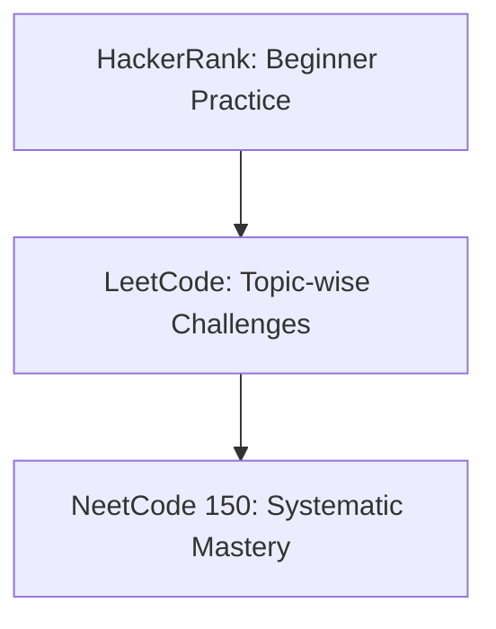

# 🧠 Mastering DSA Daily

---

> _“Start small. Be consistent. Master the fundamentals.”_

Welcome to my daily **Data Structures & Algorithms (DSA)** journey. As a beginner in problem-solving, I'm committed to solving at least **one DSA problem every day** using **Python 3**, gradually progressing from HackerRank to LeetCode and finally consolidating knowledge via the NeetCode roadmap.

---

## 🎯 Objectives

- 🟢 **Begin with HackerRank** to grasp DSA fundamentals through beginner-friendly problems  
- 🟡 **Level up with LeetCode** for more structured challenges across core topics  
- 🔵 **Consolidate via NeetCode 150** to develop interview-level mastery  
- 🧠 **Sharpen problem-solving skills** and build strong coding intuition  
- 💼 **Secure a software engineering internship** at top companies in Vietnam (e.g., VNG, Shopee, Tiki, FPT, or Big Tech branches)

---

## 🛤️ Learning Roadmap



1. 🟢 **HackerRank** – Focus on fundamentals  
2. 🟡 **LeetCode** – Practice topic-by-topic  
3. 🔵 **NeetCode** – Consolidate with 12-topic roadmap

---

## 📂 Repository Structure

```
📁 dsa_everyday/
├── hackerrank/
│   ├── warmup/
│   ├── implementation/
│   ├── strings/
│   ├── sorting/
│   ├── search/
│   ├── graph_theory/
│   ├── greedy/
│   ├── dynamic_programming/
│   ├── constructive_algorithms/
│   ├── bit_manipulation/
│   ├── recursion/
│   ├── game_theory/
│   ├── np_complete/
│   └── debugging/
|
├── leetcode/
│   ├── array/
│   ├── string/
│   ├── hash_table/
│   ├── dynamic_programming/
│   ├── math/
│   ├── sorting/
│   ├── greedy/
│   ├── depth_first_search/
│   ├── binary_search/
│   ├── tree/
│   ├── breadth_first_search/
│   ├── bit_manipulation/
│   ├── two_pointers/
│   ├── prefix_sum/
│   ├── heap_priority_queue/
│   ├── binary_tree/
│   ├── stack/
│   ├── graph/
│   ├── sliding_window/
│   ├── design/
│   ├── linked_list/
│   ├── backtracking/
│   ├── intervals/
│   ├── recursion/
│   ├── tries/
│   ├── union_find/
│   ├── divide_and_conquer/
│   └── memoization/
|
├── neetcode/
│   ├── arrays_hashing/
│   ├── two_pointers/
│   ├── stack/
│   ├── binary_search/
│   ├── sliding_window/
│   ├── linked_list/
│   ├── trees/
│   ├── tries/
│   ├── heap_priority_queue/
│   ├── intervals/
│   ├── greedy/
│   ├── backtracking/
│   ├── graphs/
│   ├── advanced_graphs/
│   ├── 1d_dp/
│   ├── 2d_dp/
│   ├── bit_manipulation/
│   └── math_geometry/
|
└── README.md
```

Each folder includes:

- ✅ **Clean Python 3 solutions**  
- 💬 **Explanation & edge case notes**  
- 🏷️ **Difficulty tags** (Easy / Medium / Hard)  
- 🔁 **Revision logs** for reattempted problems

---

## 🛠️ Tech Stack

- **Language**: Python 3 🐍  
- **Practice Platforms**: [HackerRank](https://www.hackerrank.com/), [LeetCode](https://leetcode.com/), [NeetCode](https://neetcode.io/)  
- **Tools**: VS Code, Jupyter Notebook, GitHub  

---

## 🔄 Daily Commitment

- 🗓️ **At least 1 DSA problem per day**  
- 💭 **Reflect on learnings and mistakes**  
- 🔁 **Revisit difficult problems weekly**  
- 📈 **Track progress via commits**

---

## 🏁 Final Words

> _“Small daily improvements are the key to long-term results.”_

If you're also starting out, feel free to fork this repo, give it a ⭐, or connect with me. Let’s grow together — one problem at a time.

**#DSAEveryday #Python3DSA #HackerRankToLeetCode #InternshipPrepVN**

---
